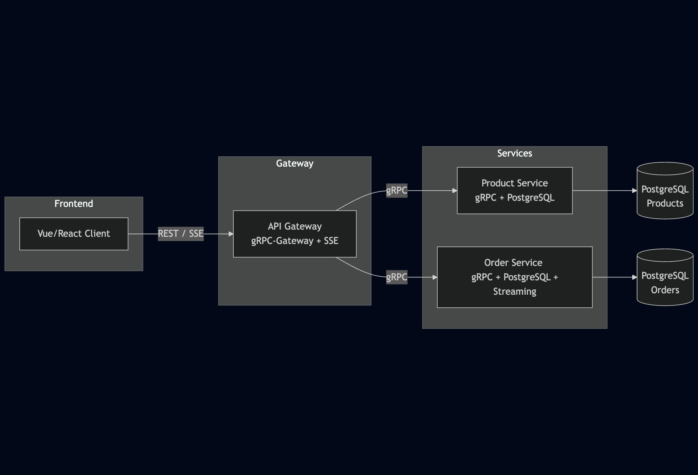

# 🛒 Shopping Cart (gRPC + Go + PostgreSQL)

Proyek ini adalah implementasi sederhana dari **Shopping Cart** berbasis **microservices** menggunakan:
- **Golang** sebagai bahasa utama
- **gRPC** untuk komunikasi antar service
- **gRPC-Gateway** sebagai REST + SSE adapter
- **PostgreSQL** sebagai database
- **Protobuf** di folder `shared` untuk definisi service & message

---

## Architecture


---

## Demo


---

## 📂 Struktur Project

```bash
.
├── api-gateway
│   ├── cmd
│   ├── go.mod
│   └── go.sum
├── order-service
│   ├── cmd
│   ├── go.mod
│   ├── go.sum
│   └── internal
├── product-service
│   ├── cmd
│   ├── go.mod
│   ├── go.sum
│   └── internal
├── shared
│   ├── auth
│   ├── config
│   ├── database
│   ├── event
│   ├── go.mod
│   ├── go.sum
│   ├── pb
│   ├── protos
│   └── utils
```


---

## 🚀 Service

### 1. Product Service
- CRUD product
- Menyimpan data produk ke PostgreSQL
- gRPC endpoint (contoh):
  - `CreateProduct`
  - `GetProduct`
  - `ListProducts`

### 2. Order Service
- Membuat order baru
- Menyimpan order ke PostgreSQL
- Mendukung **gRPC streaming** untuk update status order (PLACED → PROCESSED → DELIVERED → RECEIVED)
- gRPC endpoint (contoh):
  - `CreateOrder`
  - `StreamOrderStatus` (server streaming)

### 3. Shared
- `.proto` file untuk **Product** dan **Order**
- Utilitas common (misalnya helper DB, logger, dsb.)

### 4. API Gateway
- Menggunakan **gRPC-Gateway** untuk expose REST API di atas gRPC
- Menyediakan **SSE endpoint** untuk order status:
```GET /api/orders/stream?order_id=<uuid>```

Contoh response stream:
```json
data: {"order_id":"...","status":"PLACED","message":"order PLACED"}
data: {"order_id":"...","status":"DELIVERED","message":"order DELIVERED"}
event: completed
data: stream closed
```

---

